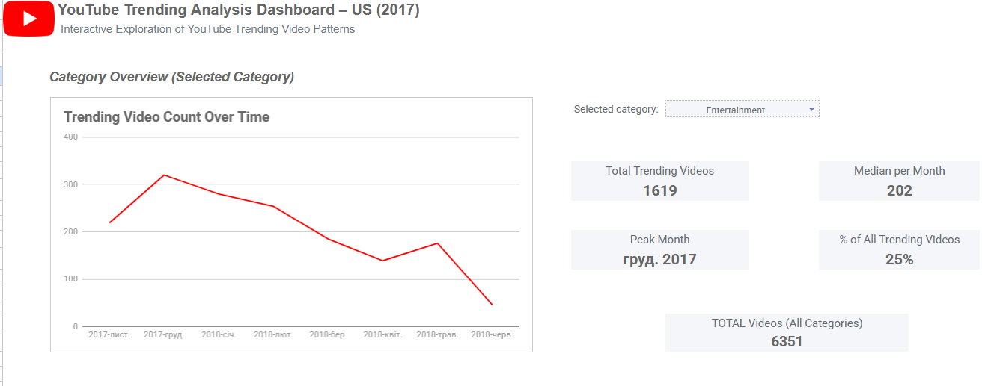
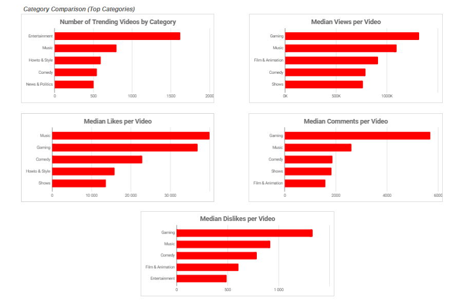

# YouTube Trending Videos Analysis (US)

This project is an exploratory data analysis of YouTube trending videos in the United States.
The goal of the analysis is to understand which video categories appear in trends most often, how user engagement differs across categories, and how trending dynamics change over time.

The analysis was performed using **Google Sheets**, with a focus on data cleaning, deduplication, and robust statistical metrics.

---
## Dashboard Overview

The interactive dashboard allows dynamic category selection.
First chart and KPI cards update automatically based on the selected category.

---
## Data Preparation

The original dataset was sourced from Kaggle and contains daily snapshots of trending videos.
Since the same video can appear in trending lists across multiple days, the raw data includes duplicate video entries.

To address this:
- Raw data was cleaned and reformatted (dates, numeric fields).
- Category names were mapped using category IDs.
- A deduplicated table was created where each video appears only once.
- Final engagement metrics (views, likes, dislikes, comments) were taken from the last day the video appeared in trends.

This approach prevents double-counting and ensures accurate category-level comparisons.

---

## Metrics Used

To reduce the impact of outliers and viral videos, **median values** were used instead of averages when comparing categories.

Key metrics include:
- Number of trending videos
- Median views per video
- Median likes, dislikes, and comments per video
- Likes-to-dislikes ratio
- Share of high-view videos (top 10% by views)

---
## Key Insights

- **Entertainment** has the highest number of unique trending videos.
- **Music** and **Gaming** achieve the highest median engagement (views, likes, comments) per video.
- Trending activity peaks in **December and January** across most categories.
- **Pets & Animals** shows the highest likes-to-dislikes ratio, indicating consistently positive audience reception.
- **Music** and **Entertainment** categories have the largest share of high-view (viral) videos.

---

## Time Trends & Category Performance

---
## Limitations

- The dataset includes only videos that reached YouTube Trending and does not represent all uploaded videos.
- Trending criteria used by YouTube are not publicly disclosed.
- The analysis focuses on the US market only.

---

## 🔗 Links

- 📄 **Full analysis report (PDF)**: [View report](report/youtube_trending_analysis_report(1).pdf)
- 📊 **Interactive Google Sheets dashboard**: *(https://docs.google.com/spreadsheets/d/18YRu2iOYRhMTFPTjw1fOlbFRaW8ucUYH3ndpz12uoh0/edit?usp=sharing)*

---

## 🛠️ Tools Used

- Google Sheets
- Pivot Tables
- QUERY, ARRAYFORMULA, VLOOKUP
- Data visualization & dashboarding

